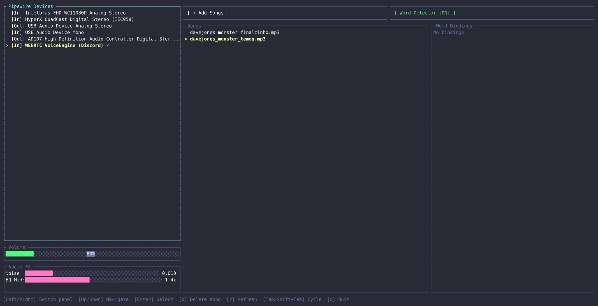

# plentysound

A Linux soundboard that plays audio through PipeWire, letting you send sounds into Discord, browsers (Meet, Zoom), or any application that accepts an audio input. Inspired by [Soundux](https://github.com/Soundux/Soundux), rebuilt from scratch because upstream has been abandoned since 2021 ([ref](https://github.com/NixOS/nixpkgs/pull/283439)).

## Features

- **Play audio to any PipeWire output** — route sounds to virtual sinks so Discord, browsers, or any app picks them up as microphone input
- **Terminal UI** — lightweight ratatui-based TUI with mouse support, volume control, comfort noise, and EQ mid-boost
- **System tray** — shows "now playing" status via a tray icon
- **Persistent config** — songs, volume, audio FX settings, and word mappings are saved across restarts
- **AI keyword detection** *(optional, `transcriber` feature)* — uses a [Vosk](https://alphacephei.com/vosk/) speech model to listen on a PipeWire input source and automatically play a sound when a configured keyword is spoken. The model is downloaded automatically from GitHub on first use

### How keyword detection works

When you enable the word detector from the TUI, plentysound:

1. Checks if the Vosk speech model is available locally
2. If not, downloads it automatically from the [plentysound-vosk-models](https://github.com/yuri-potatoq/plentysound-vosk-models) GitHub releases (a compressed `tar.zst` archive, ~50MB)
3. Extracts the model to `~/.local/share/plentysound/models/`
4. Captures audio from the selected PipeWire input source and improve audio quality for word recognition.
5. When a configured keyword is detected, the mapped sound is played

On subsequent launches, if word mappings exist and the model is already downloaded, the detector auto-starts when PipeWire devices become available.

### Vosk model mirror

The Vosk speech models used by plentysound are hosted in a separate repository: [plentysound-vosk-models](https://github.com/yuri-potatoq/plentysound-vosk-models). This repo acts as a mirror for the pre-trained Vosk models that plentysound needs for keyword detection. The mirror exists because the upstream Vosk model downloads are hosted on external servers that may be slow, unavailable, or change URLs over time. By keeping a copy in a GitHub release asset, plentysound can reliably download the correct model version without depending on third-party hosting. The daemon fetches the latest release from this repo via the GitHub API at first launch when the `transcriber` feature is enabled and no local model is found.

> NOTE: When keyword detection is enabled, since it use a local lightweight AI model, the program can have its memory usage increased to use around of ~100MB.

## Files created on host

| Path | Description |
|------|-------------|
| `~/.config/plentysound/config.yaml` | Configuration: song list, volume, audio FX, word mappings with source/output devices |
| `~/.local/share/plentysound/plentysound.log` | Daemon log file |
| `~/.local/share/plentysound/models/` | Downloaded Vosk speech model *(only with `transcriber` feature)* |
| `$XDG_RUNTIME_DIR/plentysound.sock` | Unix socket for daemon-client IPC (removed on shutdown) |

## Host dependencies

- **PipeWire[runtime]** — audio routing and capture
- **D-Bus[runtime]** — system tray support (ksni)
- **pkg-config[build-time]** — build-time dependency resolution
- **tar[runtime]** with zstd support — model extraction *(only with `transcriber` feature)*
- **Rust 1.70+[build-time]** — build toolchain
- **libvosk[build-time/runtime]** — build AI support when the feature is enabled

> NOTE: remember to remove build-time dependencies if the app is already built & package.

On Fedora/RHEL:
```bash
sudo dnf install pipewire-devel dbus-devel pkg-config tar zstd
```

On Debian/Ubuntu:
```bash
sudo apt install libpipewire-0.3-dev libdbus-1-dev pkg-config tar zstd
```

On Arch:
```bash
sudo pacman -S pipewire dbus pkg-config tar zstd
```

## How to build

### With Cargo

Basic build (soundboard only):
```bash
cargo build --release
```

With AI keyword detection:
```bash
cargo build --release --features transcriber
```

The `transcriber` feature requires `libvosk` to be available. See the [Vosk installation guide](https://alphacephei.com/vosk/install) or use the Nix build which handles this automatically.

### With Nix

The included `flake.nix` provides a complete build environment with all dependencies (including `libvosk`):

```bash
# Build
nix build

# Development shell (includes rust-analyzer, cargo-watch, etc.)
nix develop
```

### Package builds

> **TODO:** `.deb`, `.rpm`, and AUR packages are not yet available. Contributions welcome.

## How to run

plentysound uses a daemon + client architecture:

```bash
# Start the TUI client (auto-spawns the daemon if not running)
plentysound

# Or start the daemon manually in the background
plentysound daemon

# Stop the daemon
plentysound stop
```

The **daemon** runs in the background, manages PipeWire connections, audio playback, and the word detector. It listens on a Unix socket for client commands.

The **TUI client** connects to the daemon and provides the interactive terminal interface. Multiple clients can connect to the same daemon simultaneously.

## TUI navigation

### Demo!


### Panel navigation

| Key | Action |
|-----|--------|
| `Left` / `Right` | Switch between panels |
| `Tab` | Cycle to next panel |
| `Shift+Tab` | Cycle to previous panel |

### Within panels

| Key | Action |
|-----|--------|
| `Up` / `Down` | Navigate items in the focused panel |
| `Enter` | Activate: play song, open file browser, start word detector overlay |
| `d` / `Delete` | Delete selected song or word binding |
| `r` | Refresh PipeWire devices |
| `q` | Quit the TUI |

### Volume and Audio FX panels

| Key | Action |
|-----|--------|
| `Left` / `Right` | Adjust the slider value (volume, comfort noise, EQ mid-boost) |
| Mouse click | Set slider value by clicking on the bar |

### Mouse support

- Click on a **PipeWire device** to select it
- Click on a **song name** to select and play it
- Click on **volume/FX bars** to set values directly
- Click on **buttons** (Add Songs, Word Detector) to activate them

### Word detector overlay

When adding a keyword binding, the overlay guides you through:

1. **Select Audio Source** — pick the PipeWire input to listen on
2. **Select Audio Output** — pick where to play the sound
3. **Enter Word** — type the keyword to detect
4. **Pick Song** — choose which sound to play when the keyword is heard

| Key | Action |
|-----|--------|
| `Up` / `Down` | Navigate options |
| `Enter` | Confirm selection |
| `Esc` | Cancel and close overlay |

## Testing samples

Record audio samples for testing keyword detection:

```bash
# List PipeWire audio sources
pw-cli list-objects | grep -i source
# or
pactl list sources short

# Record mono 16kHz audio from a source
pw-record --rate 16000Hz --channels 1 --target <source_name_or_id> ./tests/samples/output.wav
```

## Logs

Daemon logs (useful for debugging detection and playback issues):
```bash
cat ~/.local/share/plentysound/plentysound.log
```
